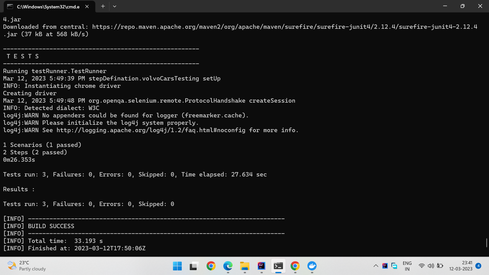

# Web application Testing with cucumber framework using Selenium and Java Including Docker Image file

This is the test automation framework developed for web application volvo cars. This automation framework is developed using selenium, cucumber, java and maven.

## Project Description

It is a behavior driven development (BDD) approach to write automation test script to test Web applications. 
It also contains the Dockerfile where the **Dockerized image** file execute the maven tests on Remote web driver
## Installation

Pre-requisite You need to have following softwares installed on your computer

1) Install JDK 1.8 and set path
2) Install Maven and set path
3) InteliJ Idea
4) InteliJ Idea Plugins: Maven and Cucumber

## Steps to Run Dockerized Image file
1. To create a docker image file for the project we need to run the below command
2. Go to project file from explorer and where the Dockerfile is present just open command prompt over there
```python
docker build -t <mydockerimage> .
```
   * mydockerimage is your image file name and . means where the docker file is present
   * docker image -> it will show the image file which is created
3. pull a selenium/standalone-chrome-debug image file into your docker to execute this test on remote webdriver
```python
docker pull selenium/standalone-chrome-debug
```
4. to run docker selenium standalone image file hit the below command
```python
docker run -d -p 4444:4444 -p 5900:5900 -v /dev/shm/:/dev/shm selenium/standalone-chrome-debug:latest
```
5. Now we need to execute our Test for that hit below command
```python
docker run -d --network="host" mydockerimage mvn -f /home/volvoCarsTestAutomationFramework/pom.xml clean test
```
7. To check the logs just hit the below command
```python
docker logs <14c260c7e9d9d062fee3cde0e4b7677d08d76ebda9970920a5e784b02caa8b54> -> session id
```
   


## Project structure

```python
Project Name
├───.settings
├───config
├───driver
├───resources
├───src
│   ├───main
│   │   └───java
│   │       ├───volvoCars
│   │       │   └───feature
│   │       ├───pages
│   │       │   └───HomePages
│   │       ├───stepDefination
│   │       │   └───volvoCarsTesting
│   │       └───utility
│   │           ├───DriverFactory
│   │           ├───Utility
│   └───test
│       └───java
│           └───testRunner
├───target
│   ├───classes
│   │   ├───volvoCars.feature
│   │   │   └───feature
│   │   ├───pages
│   │   ├───stepDefination
│   │   └───utility
│   ├───cucumber-reports
│   │       └───index.html
│   ├───classes
│   ├───generated-sources
│   ├───generated-test-sources
│   ├───surefire-reports
│   └───test-classes
│       └───testRunner
```

1) src/main/java/volvoCars/feature - Cucumber features files
2) src/main/java/pages - All page object classes
3) src/main/java/stepDefination - Cucumber step defination class
4) src/main/java/utility - Utility classes
5) src/test/java/testRunner - Cucumber test runner class


## Writing test cases
The cucumber features goes in the features library and should have the ".feature" extension.

You can start out by looking at src/main/java/volvoCars/feature. You can extend this feature or make your own features using some of the predefined steps that comes with selenium-cucumber.

## Application under test
You can find the application under test and it's guidelines in web_app_aut directory.

## Execute test cases in the framework
Navigate to your project directory from terminal and run following commands 

```python
mvn clean test
```
